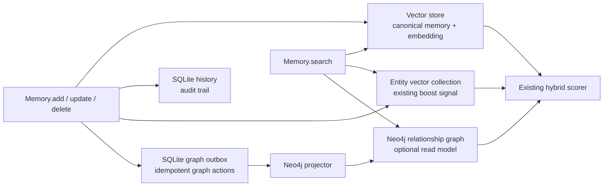
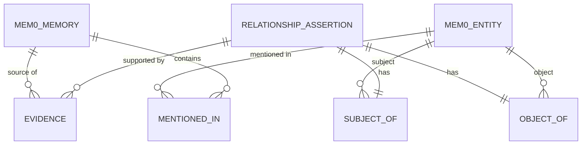
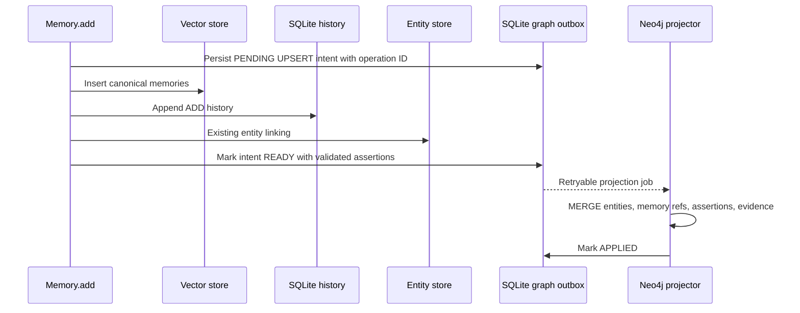

# RFC: Optional Neo4j Relationship Graph for a Mem0 OSS Fork

- Status: First manual vertical slice implemented — **review before starting slice 2**
- Owner: Personal Mem0 OSS fork
- Target: Python OSS `Memory` and `AsyncMemory`; Neo4j only in the first release
- Non-target: hosted Platform internals, arbitrary Cypher API, restoring all historical graph providers

## 1. Problem and goals

V3's built-in graph memory is a schema-free entity-to-memory index. It boosts
retrieval but deliberately does not represent a statement such as
`Alice -- manages --> Payments Team`, retain which memory asserted it, or
traverse it. This RFC adds that missing relationship layer without removing
the current vector and entity-linking pipeline.

Goals:

1. Persist typed, directed entity relationships with evidence and temporal
   provenance.
2. Keep vector memory canonical and preserve current `add`, `search`,
   `update`, `delete`, `delete_all`, and `reset` behavior when Neo4j is absent.
3. Produce graph candidates that can improve current hybrid retrieval, with
   an explanation suitable for a future API/UI.
4. Prevent cross-scope reads and writes by construction.
5. Support replay, repair, and backfill without relying on an LLM to recreate
   deleted facts.

Non-goals for the first release:

- Replacing semantic/BM25/entity retrieval or the current entity collection.
- A multi-provider graph abstraction or TypeScript parity.
- User-authored Cypher, general graph analytics, or a public graph-admin API.
- Automated contradiction resolution. Assertions are additive; invalidation is
  explicit and auditable.

### 1.1 Smallest useful implementation

The target architecture in this RFC is intentionally broader than the first
implementation. Work starts with a manual, write-only projection slice that
proves the domain model and Neo4j schema without changing normal memory writes
or search behavior.

The first slice does exactly this:

1. Accept one existing canonical memory record and its complete scope.
2. Run a separately invoked relationship extractor on that memory's text.
3. Validate and normalize the extracted subject, predicate and object.
4. Idempotently project the memory, two entities, one assertion and one evidence
   record into Neo4j.
5. Read the assertion back by exact scope and return its provenance.

The first slice does **not** hook into `Memory.add()`, change search ranking,
run a background worker, maintain an outbox, backfill a collection, or handle
updates and deletes. Those remain target behaviors and are added only after the
schema and idempotent projection have integration tests.

This boundary is deliberate. It provides a runnable end-to-end result while
keeping the first change limited to domain models, a Neo4j adapter, an explicit
projection service/function and tests.

## 2. Architectural position



| Layer | Authority | Graph responsibility |
| --- | --- | --- |
| Vector store | Canonical current memory text, metadata, embeddings | Supplies memory IDs and final memory payloads. |
| SQLite history | Append-only local audit of memory lifecycle | Records user-visible memory changes; graph events are separately auditable. |
| Entity vector collection | Existing entity-match boost | Remains schema-free and optional. It is not replaced by Neo4j. |
| SQLite graph outbox | Durable intent to project graph changes | Enables retry/replay and isolates Neo4j availability from memory writes. |
| Neo4j | Derived, queryable relationship read model | Stores typed assertions, evidence, scope and temporal validity. |

**Invariant:** a graph assertion must never be the only record of a fact. A
Neo4j result is useful only if its source memory still exists and is visible to
the caller's scope.

## 3. Domain model

### 3.1 Scope and namespace

Every graph record carries an immutable `scope_key` and `collection_name`.
`scope_key` is derived from the exact canonical scope:

```text
scope_key = SHA-256(canonical JSON of {
  user_id, agent_id, app_id, run_id
})
```

Missing values are represented explicitly as `null` in canonical JSON, so
`{user_id: "u"}` and `{user_id: "u", run_id: "r"}` cannot collide. The raw
scope fields are stored only when operational debugging requires them; product
queries use the key and the existing authorization path validates the supplied
scope before graph access. `app_id` must be lifted from metadata into the same
internal scope helper used by the server compatibility layer.

No cross-scope merge is permitted in the first release. Shared/organization
knowledge graphs require an explicit future visibility policy and are out of
scope.

### 3.2 Nodes and relationships

Relationship assertions are reified as nodes. This is intentional: Neo4j
relationships cannot themselves be endpoints for evidence/provenance links.



#### `:Mem0Memory`

Projection of a canonical vector memory; it does not duplicate full text.

| Property | Type | Purpose |
| --- | --- | --- |
| `memory_id` | UUID string | Canonical vector-store ID. |
| `scope_key`, `collection_name` | string | Tenant and collection isolation. |
| `memory_hash` | string | Detects stale projection content. |
| `created_at`, `updated_at`, `deleted_at` | ISO-8601 | Lifecycle projection state. |

#### `:Mem0Entity`

| Property | Type | Purpose |
| --- | --- | --- |
| `entity_id` | UUID string | Stable graph identity. |
| `normalized_name` | string | Lower-cased, whitespace-normalized resolver key. |
| `display_name` | string | Most recent safe display form. |
| `semantic_type` | string | e.g. `PERSON`, `ORG`, `GPE`, or required sentinel `UNSPECIFIED`; never inferred from graph topology alone. |
| `scope_key`, `collection_name` | string | Prevents cross-tenant resolution. |
| `created_at`, `updated_at` | ISO-8601 | Audit fields. |

Entities merge only on exact `normalized_name + semantic_type + scope_key +
collection_name` in v1. Approximate entity resolution is explicitly deferred;
the current 0.95 embedding merge has known ambiguity and must not become the
source of typed graph truth.

#### `:RelationshipAssertion` — the edge model

| Property | Type | Purpose |
| --- | --- | --- |
| `assertion_id` | UUID string | Idempotency and audit identity. |
| `predicate` | normalized string | e.g. `works_at`; data, not a dynamic Cypher relationship type. |
| `predicate_display` | string | Original extracted label for presentation/debugging. |
| `state` | enum | `ACTIVE`, `INVALIDATED`, `SUPERSEDED`, `RETRACTED`. |
| `valid_from`, `valid_to` | ISO-8601/null | Optional validity interval for the asserted fact. |
| `created_at`, `updated_at`, `invalidated_at` | ISO-8601/null | System lifecycle time. |
| `scope_key`, `collection_name` | string | Isolation. |
| `dedupe_key` | SHA-256 | Canonical collection/scope/subject/predicate/object/validity identity. |

The assertion connects to exactly one subject and object using fixed
relationships:

```text
(:Mem0Entity)-[:SUBJECT_OF]->(:RelationshipAssertion)-[:OBJECT_OF]->(:Mem0Entity)
```

#### `:Evidence`

Evidence is separately modeled because multiple memories can independently
support the same assertion.

| Property | Type | Purpose |
| --- | --- | --- |
| `evidence_id` | UUID string | Idempotent evidence identity. |
| `memory_id` | UUID string | Canonical source memory. |
| `excerpt_hash` | SHA-256 | Verifies the source span without storing conversation text. |
| `excerpt` | string/null | Optional redacted snippet; off by default. |
| `confidence`, `observed_at`, `recorded_at`, `retracted_at` | values/times | Source-specific provenance and lifecycle. |
| `source_kind` | enum | Origin: `USER`, `ASSISTANT`, `SYSTEM`, or `IMPORTED`. |
| `projection_method` | enum | `LIVE`, `MANUAL`, `BACKFILL`, or `LEGACY_IMPORT`. |
| `extractor_name`, `extractor_version`, `model_id` | string | Extraction reproducibility. |

```text
(:RelationshipAssertion)-[:SUPPORTED_BY]->(:Evidence)-[:FROM_MEMORY]->(:Mem0Memory)
(:Mem0Entity)-[:MENTIONED_IN]->(:Mem0Memory)
```

`MENTIONED_IN` is an optional projection of the existing entity-linking
result. It is not used to fabricate typed assertions.

Assertion state is derived or explicitly controlled as follows:

- `ACTIVE`: at least one unretracted evidence record supports the assertion.
- `RETRACTED`: no unretracted evidence remains.
- `INVALIDATED`: an explicit administrative or corrective action excludes the
  assertion regardless of remaining evidence.
- `SUPERSEDED`: a newer assertion explicitly replaces it; the replacement is
  identified by a `SUPERSEDED_BY` relationship.

Only `ACTIVE` assertions participate in retrieval. The first slice creates and
reads `ACTIVE` assertions; the other transitions belong to the lifecycle slice.

### 3.3 Input/output contracts

The provider-neutral extractor boundary accepts memory text and requires one
strict structured payload:

```json
{
  "relationships": []
}
```

Each item in `relationships` has the following structure:

```json
{
  "subject": {"text": "Alice", "semantic_type": "PERSON"},
  "predicate": "works_at",
  "predicate_display": "works at",
  "object": {"text": "Acme", "semantic_type": "ORG"},
  "confidence": 0.91,
  "observed_at": "2026-07-20T00:00:00Z"
}
```

Validation rejects empty terms, self-loops unless explicitly permitted,
unknown predicate formats, non-finite confidence, and a scope mismatch. The
initial predicate policy is lower-case snake case with a bounded length; a
future ontology may map aliases to controlled predicates.

The boundary records a stable extractor name, version and optional model ID.
It validates the complete payload and enforces a configurable relationship
count limit before returning any candidates. If the backend fails or any item
is invalid, the complete batch is rejected and no candidate is returned for
projection. Error messages identify the extractor but do not include memory
text or raw model output. The first slice uses deterministic structured test or
manual backends; an LLM-specific adapter is a later piece behind this boundary.

## 4. Neo4j schema and idempotent projection

The projector runs parameterized Cypher only. It must never interpolate entity
text, predicates, scopes, labels, or caller input into a query string.

```cypher
CREATE CONSTRAINT mem0_memory_scope_id IF NOT EXISTS
FOR (m:Mem0Memory)
REQUIRE (m.collection_name, m.scope_key, m.memory_id) IS UNIQUE;

CREATE CONSTRAINT mem0_entity_id IF NOT EXISTS
FOR (e:Mem0Entity) REQUIRE e.entity_id IS UNIQUE;

CREATE CONSTRAINT mem0_entity_scope_key IF NOT EXISTS
FOR (e:Mem0Entity)
REQUIRE (e.scope_key, e.collection_name, e.normalized_name, e.semantic_type) IS UNIQUE;

CREATE CONSTRAINT mem0_assertion_id IF NOT EXISTS
FOR (a:RelationshipAssertion) REQUIRE a.assertion_id IS UNIQUE;

CREATE CONSTRAINT mem0_assertion_dedupe IF NOT EXISTS
FOR (a:RelationshipAssertion) REQUIRE a.dedupe_key IS UNIQUE;

CREATE CONSTRAINT mem0_evidence_id IF NOT EXISTS
FOR (e:Evidence) REQUIRE e.evidence_id IS UNIQUE;

CREATE INDEX mem0_assertion_scope_state IF NOT EXISTS
FOR (a:RelationshipAssertion) ON (a.collection_name, a.scope_key, a.state);
```

The first slice uses deterministic identifiers and `MERGE` on immutable
identities:

```text
entity_id = UUIDv5(collection + scope + normalized_name + semantic_type)
assertion_id = UUIDv5(collection + scope + subject + predicate + object + validity)
evidence_id = UUIDv5(
    assertion_id + memory_id + memory_hash + excerpt_hash +
    extractor_name + extractor_version + model_id
)
```

Repeating the same explicit projection must have no observable effect after the
first successful application. The later live-write slice records outbox event
completion in an adjacent `:ProjectionEvent` node; it does not append event IDs
to graph-node properties.

The initial deployment uses one configured Neo4j database and labels all Mem0
nodes. It does not create a Neo4j database per user. An admin reset is limited
to Mem0-labeled nodes for the configured collection/scope; it must never issue
an unqualified `MATCH (n) DETACH DELETE n`.

## 5. Write, update, and delete behavior

### 5.1 Add

#### Manual vertical-slice orchestration

Before any `Memory.add()` hook exists, an explicitly invoked service accepts an
existing memory's text, canonical ID/hash, complete scope, collection and source
kind. It performs these steps synchronously:

1. Validate the complete structured extraction response.
2. Derive evidence provenance from the extractor identity and the SHA-256 hash
   of the exact supplied memory text.
3. Project every validated relationship in one managed Neo4j write transaction.
4. Read provenance back by the same collection, scope and memory ID.
5. Fail verification if any projected evidence ID is absent from readback.

An empty valid extraction performs no graph operation. An extraction failure
occurs before the graph adapter is called. A projection failure rolls back the
complete relationship batch. This service is the end of the first manual
vertical slice; it remains separate from normal memory writes.



The target architecture should share relationship extraction with the v3
extraction request where the LLM provider supports structured JSON. The first
manual projection slice instead uses a separately invoked extractor so it can
be implemented and tested without changing the existing memory extraction
contract. Consolidating the requests is a later optimization after the graph
schema is proven. A provider that cannot produce valid relationship output
yields no graph assertions, while canonical memory remains unchanged.

### 5.2 Update

V3 updates are explicit `Memory.update()` calls. When text changes:

1. Write the canonical vector update and normal history event.
2. Emit a `RETRACT_EVIDENCE(memory_id, previous_hash)` intent followed by an
   `UPSERT_ASSERTIONS(memory_id, new_hash)` intent.
3. Projector retracts evidence attached to the old hash; an assertion becomes
   `RETRACTED` only if it has no active evidence.
4. Extract and project assertions for the new text.

No relationship is deleted merely because the same words can no longer be
re-extracted. This is the key provenance guarantee missing from the prior
design.

### 5.3 Delete, delete-all, and reset

- `delete(memory_id)`: append a graph tombstone before deleting the canonical
  record; projector retracts that memory's evidence and marks its
  `Mem0Memory.deleted_at`. It never deletes another memory's supporting edge.
- `delete_all(scope)`: emits a scope tombstone with a bounded, paginated list
  of memory IDs. It must use the same filter semantics as vector deletion.
- `reset()`: requires explicit graph-reset opt-in in the config. It deletes
  only the configured Mem0 namespace after the vector reset is confirmed.

### 5.4 Failure policy and reconciliation

Neo4j failures are non-fatal to memory writes and are observable through outbox
state, metrics, and logs. The default retry policy uses exponential backoff and
a dead-letter state. An admin command must support:

- replaying one outbox event;
- rebuilding a selected scope/collection from canonical memories;
- checking graph records whose source memory is missing or hash-mismatched.

The outbox protects against a process crash between vector persistence and
graph projection. It does not retroactively make the existing vector/history
write path distributed-transactional; that limitation should be documented.

## 6. Retrieval behavior

Retrieval integration is not part of the first manual projection slice. The
behavior below describes the target read path after exact scoped graph reads
and provenance have been proven independently.

### 6.1 Exact-scope provenance reads

Before search integration, the adapter exposes two diagnostic reads:

- `provenance_by_assertion(collection_name, complete_scope, assertion_id)`;
- `provenance_by_memory(collection_name, complete_scope, memory_id)`.

Both return one typed row per supporting evidence record, ordered by
`recorded_at` and `evidence_id`. Rows include the subject, predicate, object,
assertion state, source memory and extraction provenance. These reads do not
aggregate confidence or change assertion state. Collection and scope must match
the assertion, both entities and the source memory; a partial or different
scope returns no rows.

### 6.2 Search integration target

The existing search pipeline remains the baseline. When the graph feature is
enabled and healthy:

1. Extract query entities with the existing local entity extractor.
2. Resolve exact, scope-bound graph entities.
3. Traverse only `ACTIVE` assertions, initially one hop; allow two hops only
   behind a configuration limit and time/candidate budget.
4. Return deduplicated source `memory_id`s, graph score, and a compact
   explanation (`subject`, `predicate`, `object`, source memory IDs).
5. Fetch candidates from the vector store and combine graph score with the
   existing semantic/BM25/entity score. Preserve a score breakdown.

Proposed initial score component:

```text
assertion_confidence = max(confidence of active evidence)
graph_score = max(assertion_confidence * hop_decay * evidence_weight)
final_score = existing_v3_score + graph_weight * graph_score
```

The exact `graph_weight`, candidate cap, timeout and hop limit are configuration
defaults to be benchmarked before release. Graph candidates never bypass vector
scope filters, expiration handling, or authorization. If the graph is down or
times out, return the existing v3 result and record a metric; do not fail
search.

The initial SDK response may include an opt-in `graph_explanations` field. The
legacy `relations` field is not silently restored because it had incompatible
semantics and was often ignored by clients.

## 7. Proposed configuration and API surface

Do not reuse the removed `graph_store` key. It denotes the old behavior and
would make configuration migration ambiguous.

```python
MemoryConfig(
    relationship_graph={
        "provider": "neo4j",
        "config": {
            "uri": "neo4j+s://example.databases.neo4j.io",
            "username": "neo4j",
            "password": "...",
            "database": "neo4j",
        },
        "projection_mode": "eventual",  # only supported v1 mode
        "read_mode": "boost",           # disabled | boost | explain
        "max_hops": 1,
        "candidate_limit": 50,
        "timeout_ms": 150,
        "graph_weight": 0.15,
        "reset_on_memory_reset": false,
    }
)
```

Credentials must be accepted from environment variables or an injected secret
provider as well as direct config, and must be redacted from telemetry and
errors. `relationship_graph` is an OSS Python preview feature until its schema
and operational contract are stable.

The first manual projection slice needs only the provider connection settings.
`projection_mode`, `read_mode`, scoring, reset and worker settings are accepted
only when the corresponding later slices are implemented.

## 8. Migration and rollout

1. Ship configuration validation and a disabled-by-default Neo4j connector.
2. Ship schema bootstrap, outbox, projector, and observability with graph read
   disabled.
3. Provide a resumable backfill that pages canonical memories, runs validated
   extraction, and marks evidence `projection_method=BACKFILL` while preserving
   its original `source_kind`.
4. Enable graph explanations for a small test corpus and compare candidate
   precision, latency, graph lag, and error rate.
5. Enable score boost behind an explicit preview flag.
6. Consider additional providers only after operational, correctness, and
   benchmark exit criteria are met.

Backfill cannot recover typed relations from the current entity collection;
it must process canonical memory text. Importing a legacy graph is optional
and must preserve provenance only where the old data contains it.

### 8.1 Sequential resumable backfill contract

The first backfill implementation is explicitly invoked and provider-neutral.
A canonical-memory reader returns stable pages containing only memory ID, exact
text, hash and source kind. Before extraction, a graph inspector classifies the
same collection/scope/memory/hash as `MISSING`, `CURRENT`, `CONFLICT`, or
`INCOMPLETE`:

- `MISSING` memories pass through the manual projection service;
- `CURRENT` memories are checkpointed as skipped without extraction;
- `CONFLICT` and `INCOMPLETE` memories are reported without mutation.

Processing is sequential. A privacy-safe JSON checkpoint is atomically replaced
after every handled memory and page cursor update. It records IDs, counters,
extractor version and safe failure summaries, but never memory text or raw
extractor output. A bounded `max_memories` run may stop in the middle of a page;
resume fetches that page again and skips its checkpointed IDs.

The checkpoint and Neo4j transaction cannot commit atomically. Therefore the
runner provides at-least-once processing at that boundary: if Neo4j commits and
the process stops before checkpoint replacement, preflight reconciliation sees
the projection as `CURRENT` on resume. Deterministic graph identities prevent
duplicates. The initial runner continues after per-memory extraction,
projection, verification and reconciliation failures; a page-read failure is
checkpointed and ends that invocation. Automatic repair, deletion, concurrency,
a real vector-store reader and a user-facing CLI are later pieces.

## 9. Security and privacy requirements

- Exact scope isolation is enforced in every `MERGE`, lookup and traversal.
- All Cypher is parameterized; no caller input becomes a label, relationship
  type, property name or query fragment.
- Memory text is not copied to Neo4j by default. Evidence excerpts are opt-in,
  redacted, and independently configurable.
- Extraction confidence never grants visibility or overrides scope.
- Evidence confidence cannot automatically invalidate another assertion.
- Once live projection is implemented, audit every projector action with its
  outbox ID, source kind and result.
- Connection strings and passwords are excluded from telemetry, errors and
  serialized configuration.

## 10. Verification plan and release gates

| Area | Required evidence before preview |
| --- | --- |
| Schema | Neo4j Testcontainers/integration tests apply constraints repeatedly and prove idempotency. |
| Scope | Tests prove no matching, traversal, evidence merge, delete or reset crosses `user_id`, `agent_id`, `app_id` or `run_id`. |
| Lifecycle | Add/update/delete/delete-all/reset tests verify evidence retraction and preserve independently supported assertions. |
| Reliability | Failure injection covers Neo4j unavailable, retry, duplicate outbox delivery, crash/restart and backfill resume. |
| Retrieval | Offline benchmark compares baseline versus graph boost for precision/recall, p50/p95 latency and graph contribution rate. |
| Security | Parameter-injection tests, secret redaction tests, authorization tests and poisoned/contradictory evidence cases. |
| Compatibility | Current unit suite passes with graph disabled; Python sync/async behavior agrees. |
| Operations | Metrics, health check, lag alert, replay command, reconciliation command and backup/restore runbook are reviewed. |

## 11. Decision register

Open questions use provisional defaults so they do not block the first slice.
A provisional decision may change before its affected implementation slice
begins; it is not necessary to settle later behavior while proving the schema.

| ID | Status | Question | Decision | Needed for |
| --- | --- | --- | --- | --- |
| D1 | Accepted for slice 1 | How is scope represented? | The caller supplies the complete `user_id`, `agent_id`, `app_id`, `run_id` tuple; missing values are canonical `null`. Partial-scope expansion is not supported. | First slice |
| D2 | Accepted for slice 1 | Where does relationship extraction run? | Use an explicitly invoked, separate extractor in the first slice. Consider merging it into the v3 extraction request only after the schema is proven. | First slice |
| D3 | Accepted for slice 1 | How are entities resolved? | Exact normalized name + semantic type + scope + collection only. No aliases or embedding merge. | First slice |
| D4 | Provisional | Can graph results expand search candidates? | Initially rerank semantic candidates only. Graph-only candidate expansion requires separate retrieval evaluation. | Retrieval slice |
| D5 | Provisional | What happens on deletion? | The initial lifecycle slice hard-deletes evidence for deleted memories and retracts unsupported assertions. Historical retention can be added only with an explicit privacy policy. | Lifecycle slice |
| D6 | Accepted for slice 1 | What Neo4j deployment is supported? | Neo4j Community 5.x in Docker is the development and integration-test baseline. Enterprise-only constraints are not required. | First slice |
| D7 | Provisional | How are projection events processed? | No outbox in the first slice. Projection is an explicit operation. Before live write hooks are added, choose and test a durable SQLite outbox with a `ProjectionEvent` ledger. | Live-write slice |

Decisions are promoted from provisional to accepted when the named slice begins.
Changing a decision requires updating this table and any affected tests; a
separate ADR is needed only for a change to the architectural position that
Neo4j is a derived, optional read model.

## 12. Implementation boundary

After approval, implementation should proceed in reviewable slices:

1. Domain models, pure validation tests, Neo4j schema, one explicit projection
   operation and an exact-scope provenance read integration test.
2. Manual collection backfill and reconciliation command, still without memory
   write hooks or search integration.
3. Update/delete lifecycle behavior and privacy tests.
4. SQLite outbox and live-write projector, with graph reads still disabled in
   normal search.
5. Read-only explanation API and semantic-candidate reranking.
6. Only after retrieval evaluation, consider graph-only candidate expansion and
   measured score boosting.

The first slice is complete when one integration test demonstrates all of the
following against Neo4j Community 5.x:

- one canonical memory produces two exact-scope entities, one assertion and one
  evidence record;
- projecting the same input twice produces no duplicate nodes or relationships;
- the assertion and its evidence can be read back by exact scope;
- the same entity names in a different scope or collection remain isolated;
- invalid extractor output creates no partial graph state.

Stop after these criteria pass and review the resulting schema and API before
starting collection backfill or lifecycle integration.

### 12.1 First-slice implementation record

As of 2026-08-13, the first slice is implemented behind an explicitly invoked
service. It includes pure domain validation, deterministic identities, Neo4j 5
Community-compatible schema bootstrap, atomic batch projection, exact-scope
provenance reads and a provider-neutral structured extractor boundary.

Focused verification passes with 73 tests. Three opt-in integration tests also
pass through the Neo4j Python driver against a disposable Neo4j 5 container,
covering repeated schema bootstrap, projection idempotency, hash conflicts,
scope isolation and the complete manual extraction-to-readback path. Normal
memory writes and search remain unchanged. This is the required review stopping
point before manual collection backfill.

No legacy provider code should be copied into the new implementation without a
specific reviewed adaptation plan.
